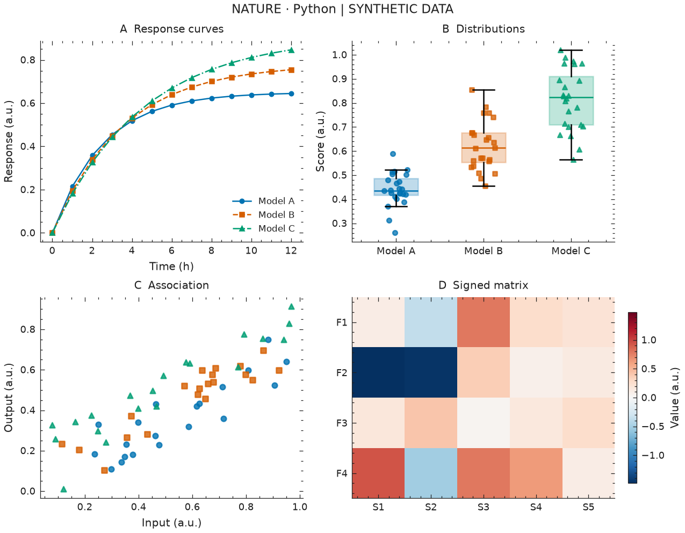
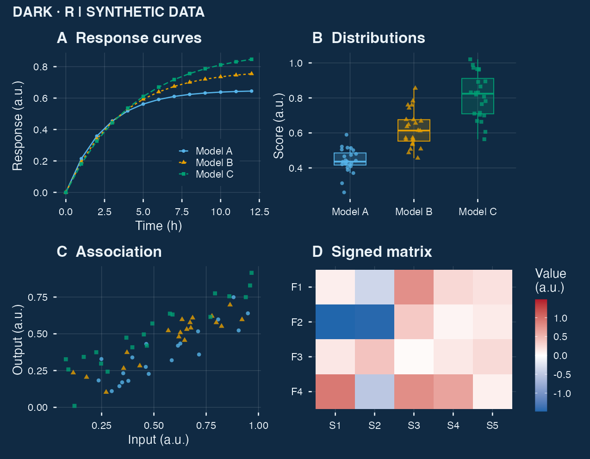

# Scientific Plotting Skills

[](https://github.com/bioinfo-ccnu/scientific-plotting-skills/actions/workflows/validate.yml)
[](LICENSE)

A reusable AI-agent skill for reproducible scientific figures in **Python and R**, maintained by [CCNU Bioinformatics](https://github.com/bioinfo-ccnu). Create a plot from data, restyle an existing figure, or assemble a multi-panel figure with editable source and explicit export settings.

Python uses **Matplotlib / SciencePlots**, with Seaborn available for statistical plots. R uses **ggplot2 / patchwork**, with optional ggthemes, ggsci, ComplexHeatmap and ggraph adapters. Scanpy can display existing AnnData embeddings. Both backends share the same preset and categorical palette configuration.

| Python · Nature-inspired | R · Dark |
|---|---|
|  |  |

**All gallery data are synthetic style demonstrations, not research results.** [Browse all 8 styles in both backends →](examples/gallery/README.md)

## Install the skill

The installable skill is [`skills/scientific-plotting`](skills/scientific-plotting). Copy the **whole folder**, including scripts, references and assets, into your agent's skills directory. For Codex, run:

```bash
git clone https://github.com/bioinfo-ccnu/scientific-plotting-skills.git
mkdir -p "${CODEX_HOME:-$HOME/.codex}/skills"
cp -R scientific-plotting-skills/skills/scientific-plotting \
  "${CODEX_HOME:-$HOME/.codex}/skills/"
```

If a skill with that name is already installed, compare it before replacing it. Refresh the agent's skill discovery after installation. The folder follows the `SKILL.md` convention; support and discovery behavior depend on the host agent.

Invoke it explicitly with `$scientific-plotting`, or let an agent that supports automatic skill discovery select it for research plotting. Installation adds instructions and helpers; it does not automatically install Python or R packages.

## Use it

Example requests:

> Use $scientific-plotting with Python. Plot my measurements.csv as a Nature-inspired two-panel figure with raw points and a time-course plot. Keep group colors consistent and export a 180 × 90 mm PDF, SVG and 300 dpi PNG.

> Use $scientific-plotting with R and patchwork. Restyle my ggplot figure for a dark-background presentation, preserving the data and uncertainty definitions.

> Use $scientific-plotting with R. Draw a volcano plot from my differential-analysis results, preserving supplied log2 fold changes and adjusted p values. Use English labels and export PDF, SVG and TIFF.

Provide data, its units and experimental structure, the intended message, and any required figure dimensions or style reference. The skill can guide line/scatter plots, distributions, heatmaps, forest plots, ROC/PR curves, volcano plots, enrichment plots and other data-driven figures. Specialist plot types may require additional domain packages and supplied analysis results.

## Expanded capabilities

**22 runnable recipes in both Python and R**, with synthetic CSV templates, YAML configurations, data validation and rendered examples.

| Area | Included capabilities |
|---|---|
| General plots | Raincloud, paired comparisons, ribbons, forest plots, correlation matrices, facets |
| Bioinformatics | Volcano, MA, GO/KEGG enrichment bubbles from supplied results, exact-intersection UpSet, clustered/annotated heatmaps |
| Model evaluation | ROC, PR, confusion, calibration, prediction vs observation, ablation, multi-model benchmarks |
| Statistics | Sample sizes, mean differences, effect sizes, confidence intervals, paired t/Welch/signed-rank tests, BH/Bonferroni correction |
| Paper panels | A–F/custom tags, shared legends/compatible axes, consistent typography/colors, zoom insets |
| Data and batches | CSV/TSV/Excel, canonical column mapping, long/wide reshape, YAML, several styles from one job |
| Automated QA | Estimated label overlap/clipping, fonts/glyphs, contrast, export dimensions and raster resolution, JSON reports |
| Network and single cell | Edge networks, dendrograms, supplied UMAP coordinates and gene-expression DotPlots; optional ggraph/ComplexHeatmap/Scanpy |

[Browse the recipe galleries →](examples/gallery/recipes.md) · [Input schemas and templates →](skills/scientific-plotting/references/recipes.md) · [YAML guide →](skills/scientific-plotting/references/configuration.md)

These helpers visualize supplied results. They do not silently run differential expression, enrichment, embedding inference or model training. Statistical comparisons require an explicit experimental unit and chosen method. Automated QA identifies possible issues and still needs visual review.

## Styles

| Preset | Appearance / use |
|---|---|
| `science` | Serif scientific figures |
| `nature` | Compact sans-serif figures |
| `ieee` | Grayscale with line/marker distinctions |
| `minimal` | Restrained typography and subtle grids |
| `presentation` | Larger text for slides |
| `dark` | Navy background with bright categorical colors |
| `poster` | Large-format labels |
| `accessible` | Color plus redundant line/marker encodings |

Change fonts, colors, sizes and layouts as needed. Journal names describe inspired presets, not journal endorsement or guaranteed submission compliance. R presets are original analogous themes; SciencePlots itself is a Python dependency. See [style guidance](skills/scientific-plotting/references/styles.md).

## Run the examples

Python 3.10+:

```bash
cd scientific-plotting-skills
python -m venv .venv
source .venv/bin/activate
python -m pip install -r requirements.txt
python examples/python_gallery.py
# One preset, custom output directory:
python examples/python_gallery.py --preset nature --out build/nature
```

R 4.2+ (install into your chosen project library):

```r
install.packages(c("ggplot2", "patchwork", "jsonlite", "svglite", "ragg",
                   "yaml", "readxl", "xml2", "systemfonts"))
```

```bash
Rscript examples/r_gallery.R
Rscript examples/r_gallery.R build/r-dark dark
```

Run a recipe, statistical comparison or Excel reshape job:

```bash
python skills/scientific-plotting/scripts/plot_cli.py examples/configs/volcano.yml
python skills/scientific-plotting/scripts/plot_cli.py examples/configs/statistics.yml
Rscript skills/scientific-plotting/scripts/plot_cli.R examples/configs/excel.yml
# Identical YAML, another backend; explicit output stem:
python skills/scientific-plotting/scripts/plot_cli.py examples/configs/prediction.yml \
  --backend r --output build/r-prediction
# All four category galleries, two styles each:
python examples/recipe_gallery.py --backend python --out build/expanded-python
python examples/recipe_gallery.py --backend r --out build/expanded-r
```

The runners write PDF/SVG/PNG plus metrics/provenance `*.plot.json`, heuristic `*.qc.json`, resolved `*.config.yml`, runnable `*.source.py`/`*.source.R` and statistical tables where requested. Keep the original data and installed helper version for reproduction. YAML paths are relative to the configuration file; command-line output stems are relative to the working directory. See the [configuration guide](skills/scientific-plotting/references/configuration.md), [statistical definitions](skills/scientific-plotting/references/statistics.md) and [QA limits](skills/scientific-plotting/references/automation-quality.md).

Optional domain integrations:

```bash
python -m pip install -r requirements-single-cell.txt
```

```r
install.packages(c("ggraph", "igraph", "BiocManager"))
BiocManager::install("ComplexHeatmap", ask=FALSE, update=FALSE)
```

Run `python examples/domain_adapters.py` or `Rscript examples/domain_adapters.R` for synthetic demonstrations. These functions are separate adapters; the core recipes do not require their packages. See [adapter usage](skills/scientific-plotting/references/domain-adapters.md).

The original style-gallery scripts read the same committed CSV files and work from any current directory. Python writes to `build/python`, R to `build/r`; custom relative output paths are relative to your current directory. Both produce PDF, SVG, PNG and `*.plot.json` export metadata. Existing outputs are protected; use a fresh directory or explicitly request replacement (Python CLI supports `--overwrite`; R helper supports `overwrite = TRUE`). Regenerate synthetic data with `python examples/generate_data.py` (seed 2026).

The reusable helpers also support TIFF. Portable Python presets do not need LaTeX; enable TeX only when an existing installation is available. R uses ragg for PNG/TIFF where installed, with a supported base-device fallback; TIFF export checks LZW device support before rendering. PDF/SVG font availability should be checked on the target system.

## Reproducibility and checks

The helpers use explicit canvas dimensions, temporarily apply Python styles, retain semantic category mappings, validate export requests, render into staging, and protect existing files. Metadata records dimensions, resolution, backend versions and user-supplied provenance. Keep the input data and plotting source alongside exported figures.

The standard R PDF device rounds its page box down to whole points (less than 0.353 mm per dimension). R manifests record both the requested dimensions and measured `pdf_page_mm`; SVG retains the requested size within decimal rounding. Use the SVG or an explicitly verified PDF conversion when sub-point page precision is required.

```bash
python -m pip install -r requirements-dev.txt
python -m pytest tests -q
Rscript tests/test_r.R
Rscript tests/test_recipes.R
```

CI runs the core checks and expanded galleries in both backends, with separate jobs exercising Scanpy and the R domain adapters. Tests cover all presets, 22 recipes, real metric calculations/ties, matched subjects, corrections, Excel reshape, batch failures/collisions, reproduction wrappers and detectable QA problems. The Matplotlib upper bound avoids APIs SciencePlots currently uses that are scheduled for removal in Matplotlib 3.13; deprecation warnings on 3.11 are upstream and currently do not prevent rendering.

## Contribute

Add a preset, improve a backend, or propose a domain-specific plotting recipe. Keep statistical meaning separate from styling, preserve existing data, add a runnable example for a new capability, and describe what you verified. Do not commit confidential research data; use clearly identified demonstration data in public examples.

## Credits and license

Original skill instructions, helper code and examples are released under the [MIT License](LICENSE). Third-party libraries remain under their own licenses; they are dependencies rather than vendored source.

- [SciencePlots](https://github.com/garrettj403/SciencePlots) and [Matplotlib](https://matplotlib.org/)
- [ggplot2](https://ggplot2.tidyverse.org/) and [patchwork](https://patchwork.data-imaginist.com/)
- Optional: [Seaborn](https://seaborn.pydata.org/), [ggthemes](https://jrnold.github.io/ggthemes/), [ggsci](https://nanx.me/ggsci/), [ComplexHeatmap](https://jokergoo.github.io/ComplexHeatmap-reference/book/), [ggraph](https://ggraph.data-imaginist.com/), [Scanpy](https://scanpy.readthedocs.io/en/stable/)

Maintained by [Lei Wang](https://wangleiofficial.github.io/) · [CCNU Bioinformatics](https://github.com/bioinfo-ccnu).
