# Style gallery

[View the expanded 22-recipe galleries and domain adapters →](recipes.md)

All inputs are synthetic (seed 2026). Each backend reads the same CSV files. Panels show response curves, distributions with every observation, association, and a signed matrix. The box spans the interquartile range, its center is the median, and whiskers use the 1.5 × IQR convention; raw points include outliers. Heatmaps use symmetric limits, with a sequential grayscale map for IEEE and a zero-centered diverging map for other presets.

R and Python share categorical colors; their typography, default ticks, heatmap interpolation and graphics devices differ. Each example explicitly distinguishes models with shapes/line types.

See the [Python source](../python_gallery.py), [R source](../r_gallery.R), [input data](../data), and [run instructions](../../README.md#run-the-examples).

| Style | Python | R |
|---|---|---|
| `science` |  | 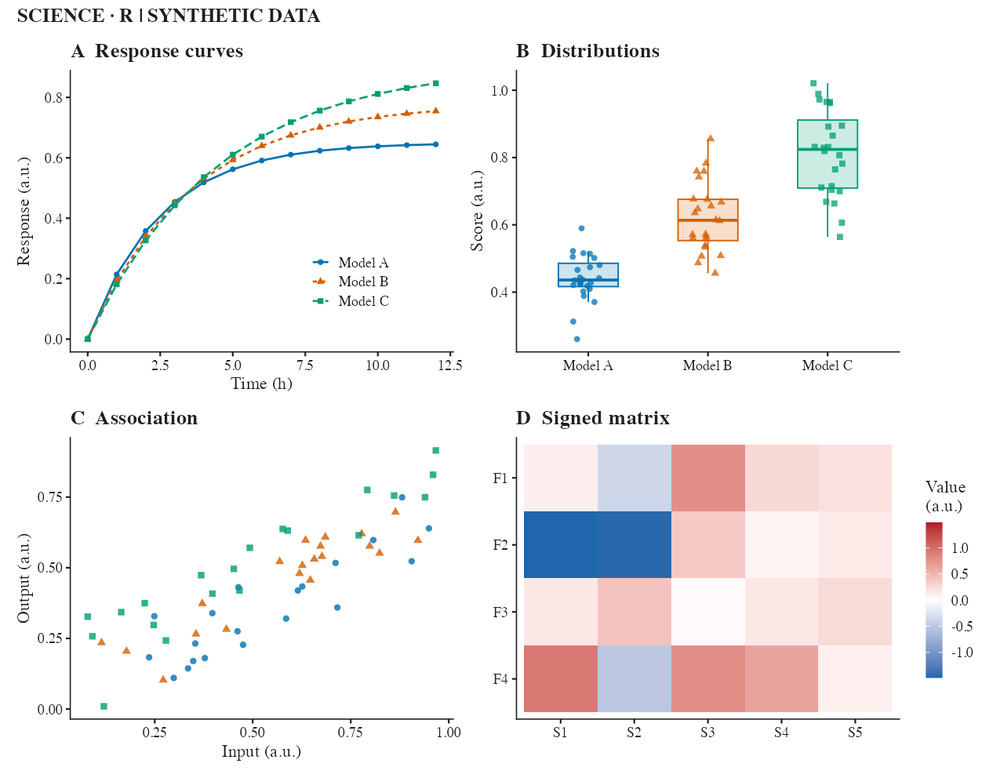 |
| `nature` |  | 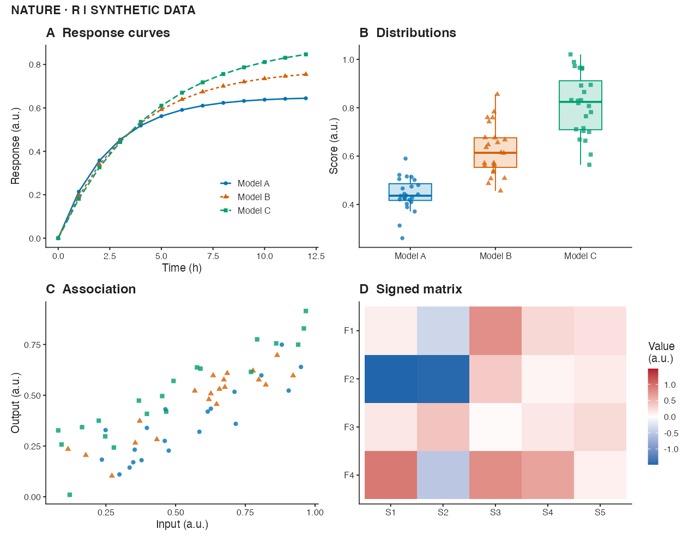 |
| `ieee` | 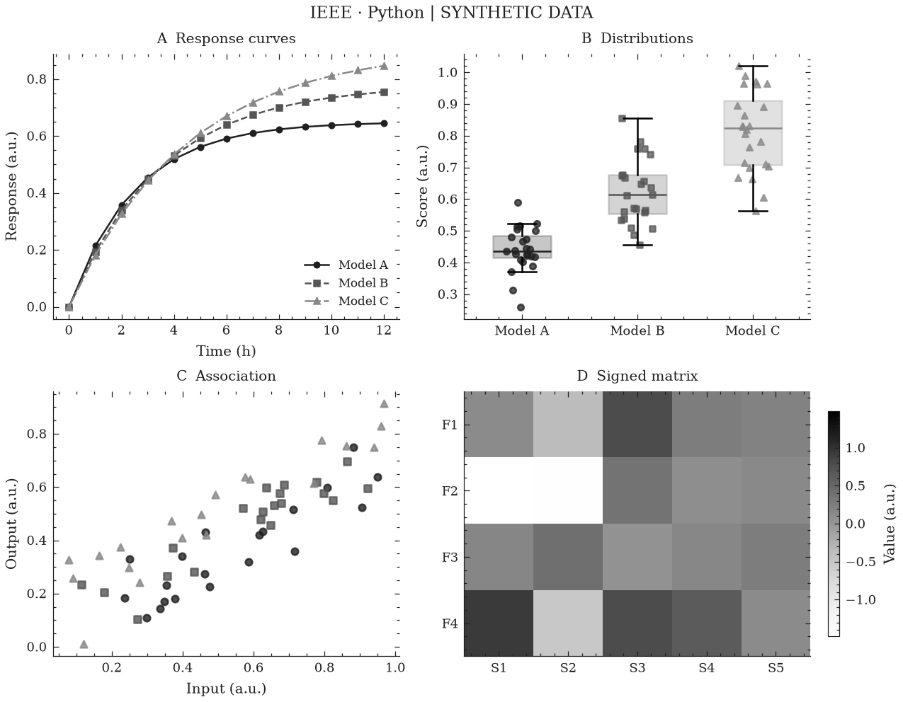 | 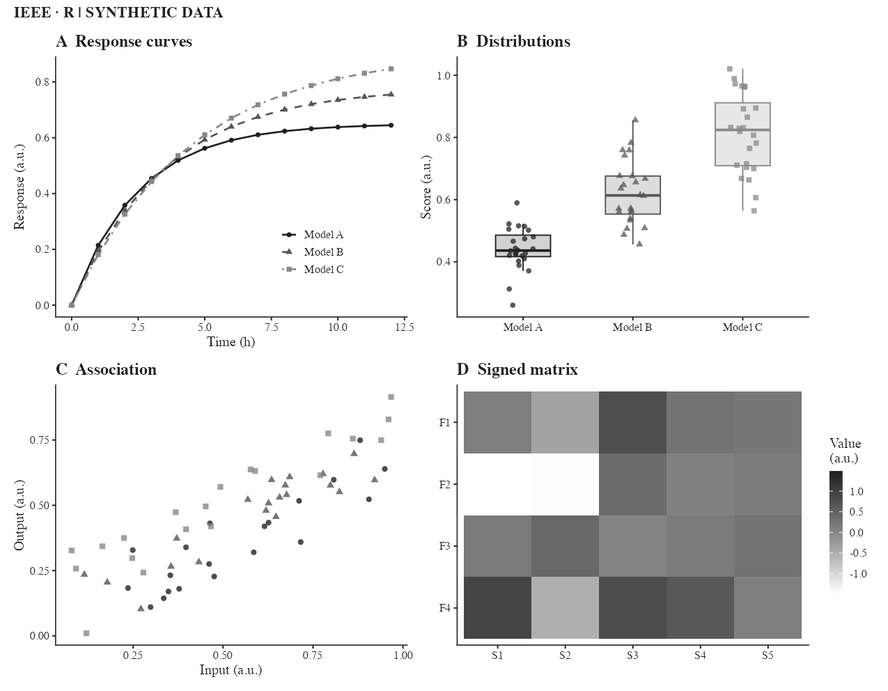 |
| `minimal` | 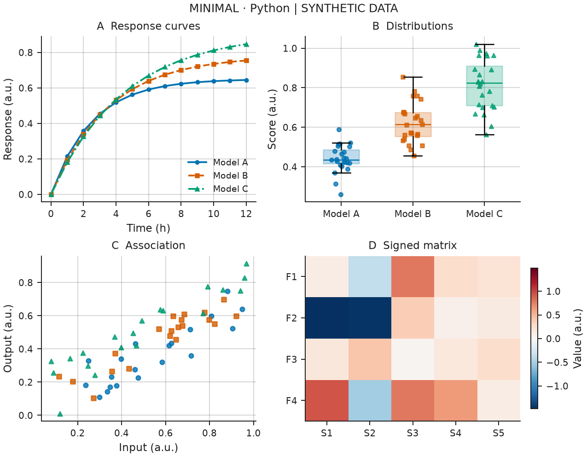 | 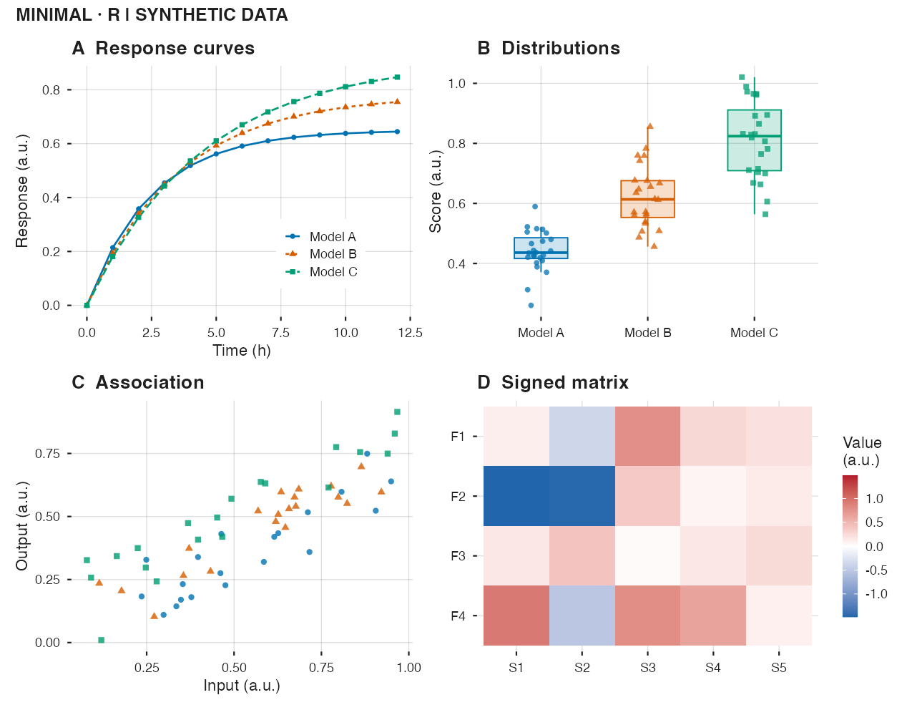 |
| `presentation` | 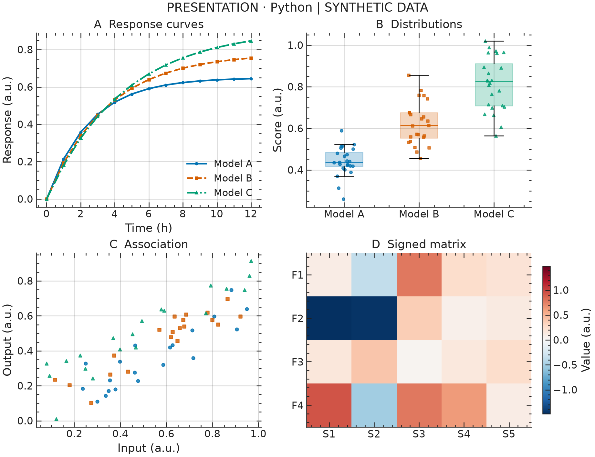 | 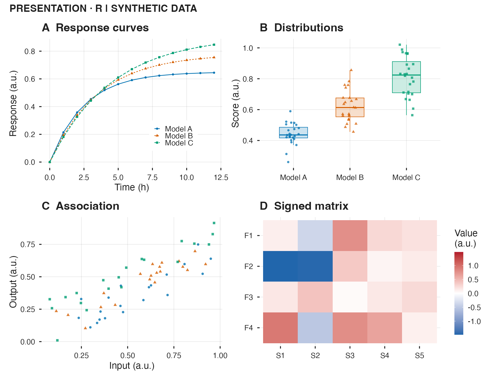 |
| `dark` | 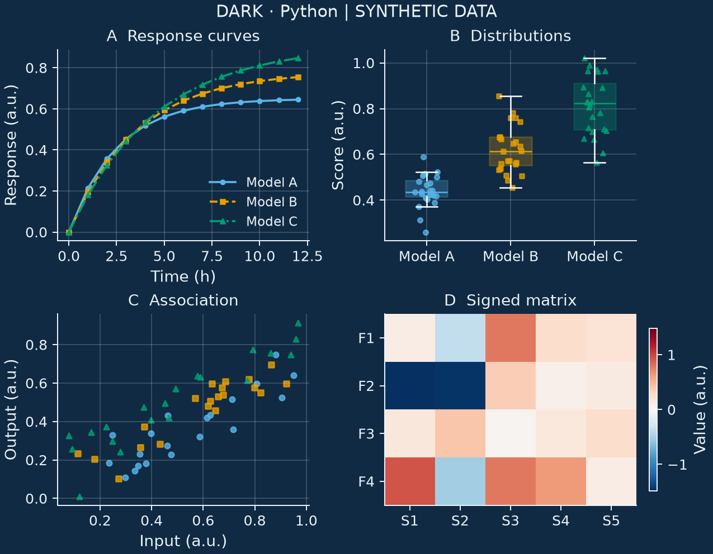 |  |
| `poster` | 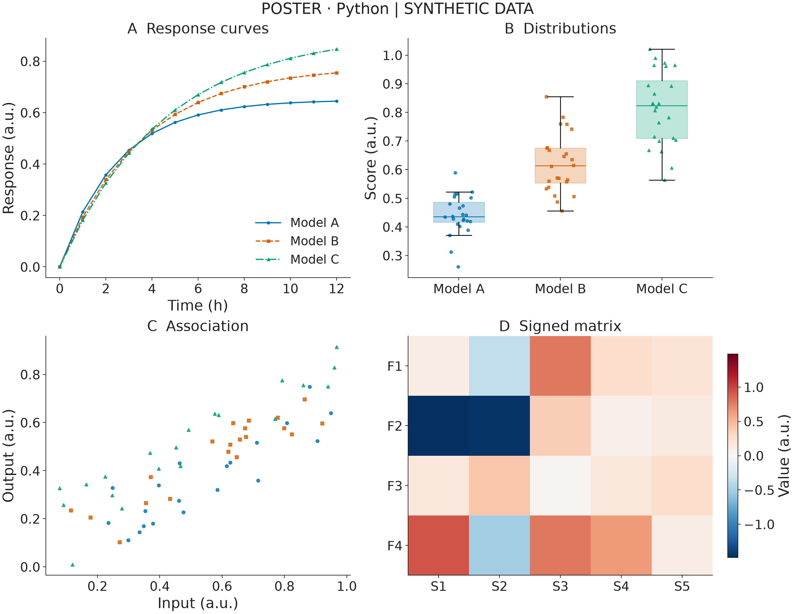 | 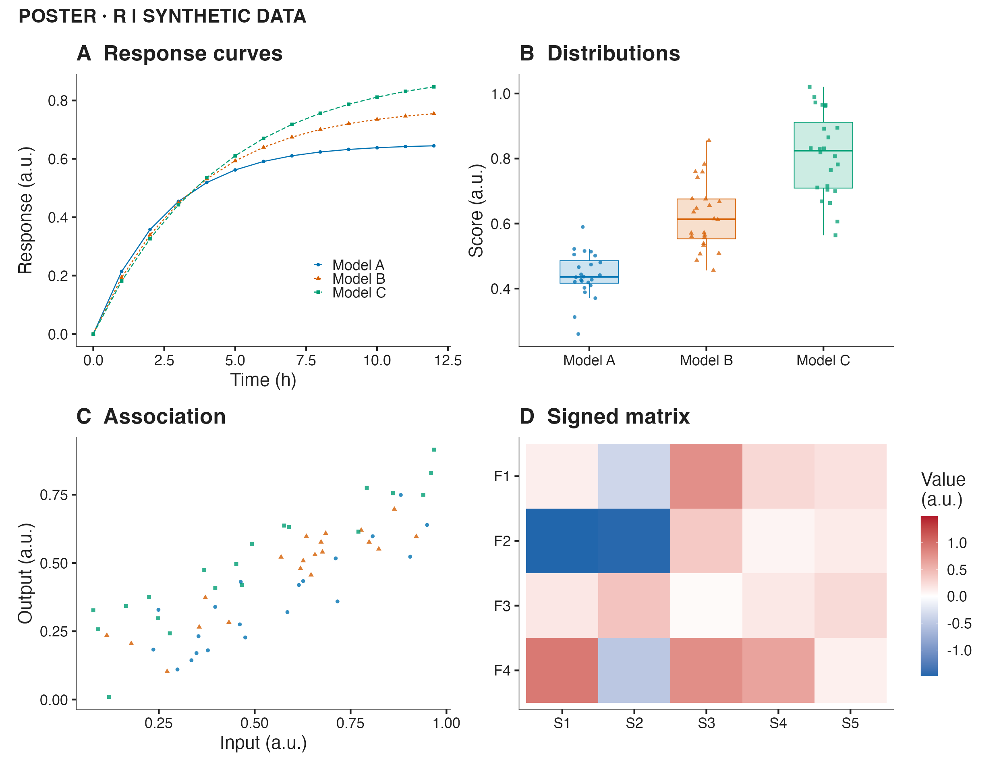 |
| `accessible` | 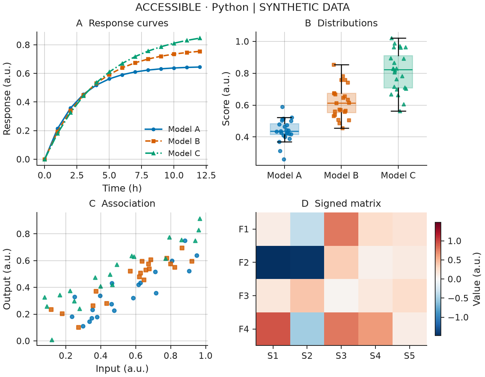 | 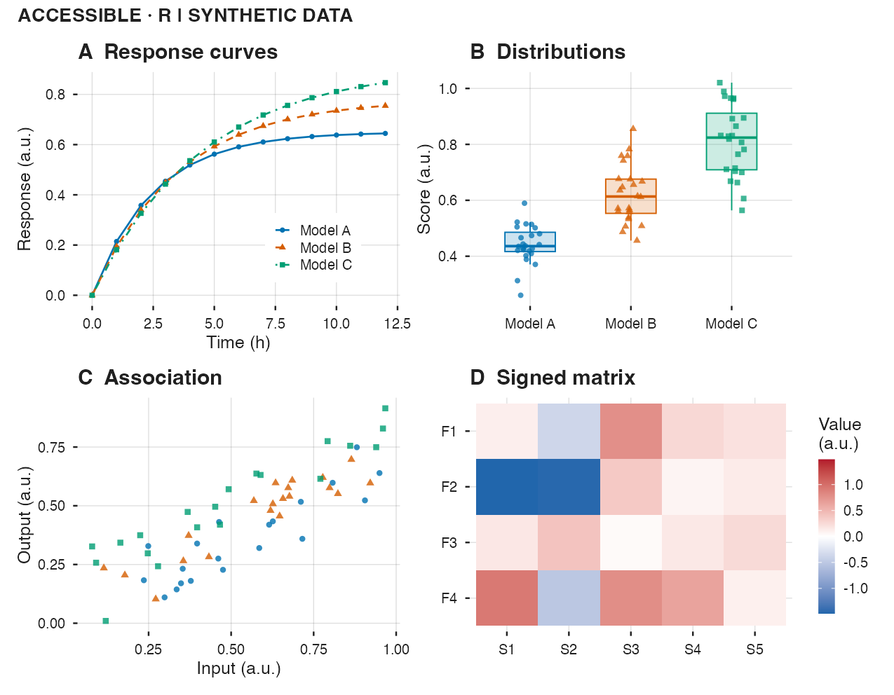 |
